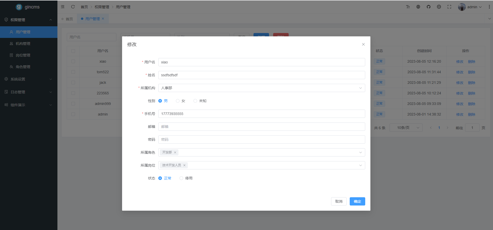
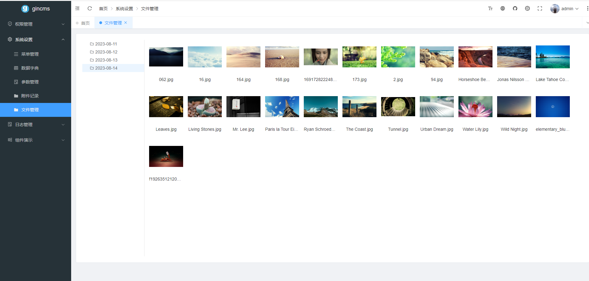
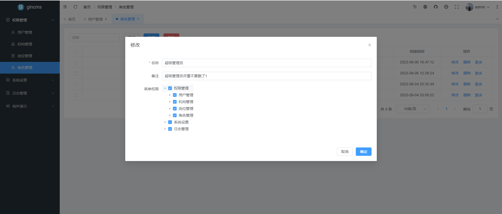

<div align="center">


<p align="center">
	<a href="https://github.com/gin-gonic/gin" target="_blank">
		
	</a>
	<a href="https://gorm.io/zh_CN/docs/" target="_blank">
		
	</a>
	<a href="https://v3.vuejs.org/" target="_blank">
		
	</a>
	<a href="https://element-plus.gitee.io/#/zh-CN/component/changelog" target="_blank">
		
	</a>
</p>

<h1>Gincms</h1>
</div>

## 介绍

gincms是一个前后端分离的开源系统.它(**开源/免费/可商业**)

>后端使用go语言,gin框架,gorm
gincms的宗旨是让初/中级go语言爱好者,快速使用gincms开发相关应用.
### 系统将开源包括如下模块
- 后台管理系统(基础rbac)
- cms管理后台,包含前端(如:企业官网,资讯网站...)-----开发中
- 博客系统,包含前端博客展示,后台博客内容管理-------开发中

> 后台管理系统是前后端分离，它的前端是基于maku-admin，
maku-admin是基于Vue3、TypeScript、Element Plus、Vue Router、Pinia、Axios、i18n、Vite等开发的后台管理，使用门槛极低，采用MIT开源协议，完全免费开源且终身免费，可免费用于商业项目等场景。


无论是个人、团队、或是企业，都能够使用gincms助力相关应用的开发
####  演示和文档
| 类型 | 链接 |
| -------- | -------- |
| 文档及官网地址 | http://www.gincms.com/ |
| 演示地址  | http://webdemo.gincms.com/ (账号:admin,密码:admin)|


## 部分截图



#### 软件架构
软件架构说明(todo)

#### gincms后端开发环境安装教程

1. 下载源码到本地,并进入目录中
```
git clone https://github.com/weiyunxiao/gincms.git
cd gincms
```

2. 配置好数据库信息
在mysql服务器上新建"gincms"数据库,编码选择utf8mb4
导入db/gincms.sql文件

3.  整理配置文件
复制config.yaml.example一份,将新的复制文件重命名config.yaml,并修改其中相关配置信息(例如:==mysql配置信息==)
例如
```
cp config.yaml.example config.ymal
```
4.  运行程序,(**注意有无错误信息**)
```
go run ./main.go
```
#### gincms后台管理前端开发环境安装教程
1. 进入根目录下的web目录,例如:
```
cd web
```
2. 执行 npm install安装依赖,例如:
```
npm install
```
3. 运行开发环境,例如:
```
npm run dev
```


#### 使用说明

1.  xxxx
2.  xxxx
3.  xxxx


#### 参与贡献

1.  Fork 本仓库
2.  提交代码
3.  新建 Pull Request

##### 正式环境部署
###### 1. docker部署
1. 进入项目根目录
```cd gincms```
2. 编译成linux可执行文件
```GOOS=linux GOARCH=amd64 CGO_ENABLED=0 go build -o gincms -ldflags="-w -s" main.go```
3. ==确保当前目录下面有config.yaml配置文件==
4. 最后执行运行脚本
```
chmod +x ./build.sh
./build.sh
```
##### 特别鸣谢
💕 感谢巨人提供肩膀，排名不分先后
- [gin](https://github.com/gin-gonic/gin/)
- [gorm](https://gorm.io/zh_CN/)
- [gin-vue-admin](https://github.com/flipped-aurora/gin-vue-admin)
- [maku-boot](https://github.com/makunet/maku-boot)